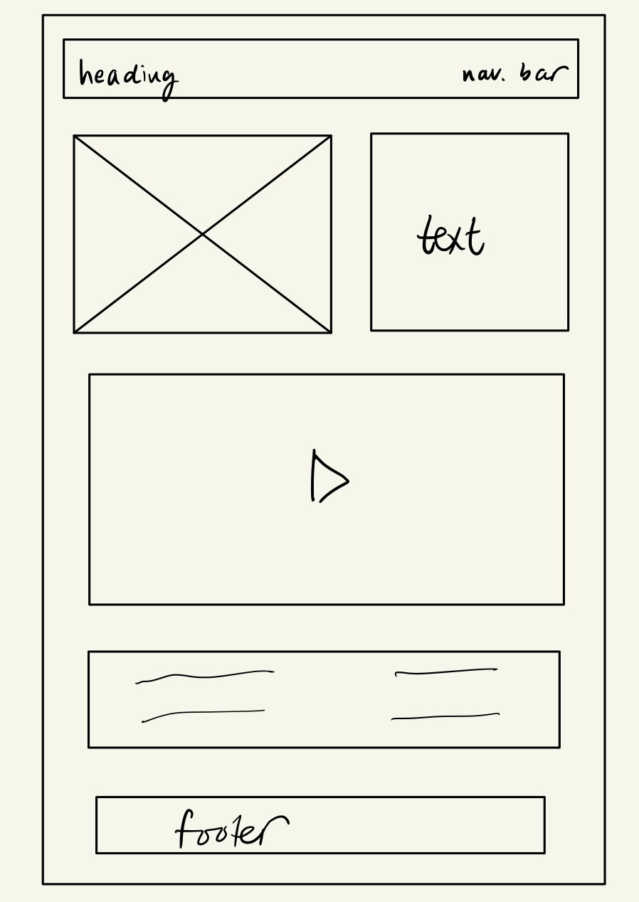

# Connections_Lab_Week1

## Week 1 HW - Make a webpage for one of your present/past projects

### Design
In this assignment, I created a webpage for a desktop game I made for my Intro to CS class. The theme of the game is space, so I wanted my website to reflect that through the background and the font. Thus, I chose a thick futuristic-kind of font for the heading and blue color for the background as I think blue and black are the colors that first come to mind when we think of planets and space, and it is also a color that is frequently used in my game. For the body texts, I used a sans-serif font to make it look organized but not too formal. 

### Reflection
Making this website took a considerably long time than I thought. It's been a while since I last made a proper webpage during Communications Lab class, so I had to frequently google questions and use MDN for topics like adding tables, embedding a video, changing line heights etc. The flexbox froggy exercise turned out to be really helpful and made aligning items on the webpage a bit less challenging. I also used the Developer Tools to decide on the changes to make to my code before actually editing the code, which made the debugging experience so much easier. One of the things I struggled with the most was the sizing of different elements, especially when it comes to choosing between pixels, per cents, em, rem, vw etc. I tried to use pixels as less possible, only for paddings and margins, and mostly used em. I wasn't able to make the webpage fully responsive and I really hope we can cover responsiveness in one of our workshops. 

Overall, this exercise was a good practice to get back to HTML and CSS, and I'm glad that I spent enough time on it to recall my previous knowledge from Comm Lab. 

